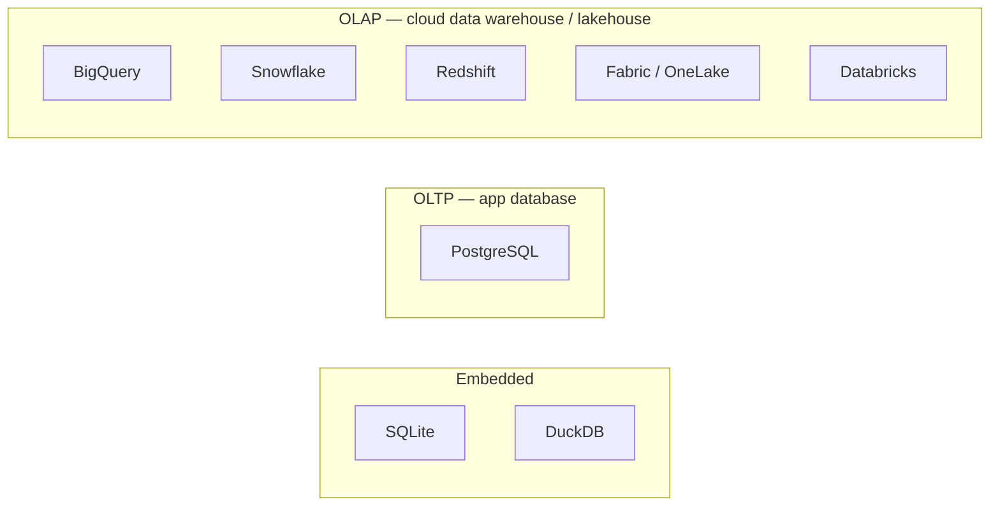

# SQLite vs DuckDB vs PostgreSQL vs BigQuery vs Fabric/OneLake vs Snowflake vs Databricks vs Redshift

## The big picture first

These 8 tools fall into 3 very different categories. Confusing the
category is the #1 mistake — they are not interchangeable.

| Category | Tools | What it's for |
|---|---|---|
| **Embedded / single-machine DB** | SQLite, DuckDB | No server. A file (or in-memory) database that lives inside your app or script. |
| **Traditional server database (OLTP)** | PostgreSQL | A running server handling many small, fast read/write transactions (an app's live database). |
| **Cloud data warehouse (OLAP)** | BigQuery, Snowflake, Redshift, Fabric/OneLake, Databricks | Built to scan billions of rows for analytics — reporting, BI dashboards, ML — not for a live app's clicks. |

**OLTP vs OLAP**, the key distinction underneath everything below:
- **OLTP** (OnLine Transaction Processing) = many small operations: "insert
  this order," "update this user's email." Row-by-row. PostgreSQL, SQLite.
- **OLAP** (OnLine Analytical Processing) = few, huge operations: "sum
  revenue across 2 billion rows, grouped by month." Column-by-column.
  BigQuery, Snowflake, Redshift, Databricks, Fabric.



---

## 1. SQLite

**What it is:** a database that is just **one file** on disk. No server,
no network, no separate process — your application links a library and
reads/writes the file directly.

- **Compute:** whatever machine runs your app. No separate compute to manage.
- **Storage:** a single `.sqlite`/`.db` file, local disk.
- **Cost:** $0 — it's a free, open-source library, no hosting.
- **SQL:** a real but limited SQL dialect. Weak typing (a column declared
  `INTEGER` can still store text), limited `ALTER TABLE`, no built-in
  `RIGHT JOIN` (until recent versions), no stored procedures, no user
  management (there are no users — it's just a file).
- **Pipelines:** none — you write to it directly from your app/script with
  a driver (e.g. Python's built-in `sqlite3` module). No orchestration
  concept; it's just file I/O.

**When to use it:** mobile apps (it's the default DB on iOS/Android),
desktop apps, small scripts/tools, local caching, unit tests, prototypes.
**Never** for a multi-user server app (file locking becomes a bottleneck)
or for analytics over large datasets.

---

## 2. DuckDB

**What it is:** "SQLite for analytics." Also a single-file/in-process
embedded database with **no server**, but built column-oriented and
optimized for OLAP-style aggregations instead of row-by-row transactions.

- **Compute:** the local machine/process running it — but it's built to
  use multiple CPU cores efficiently and can process data larger than RAM.
- **Storage:** its own compact file format, but its superpower is querying
  **external files directly** — CSV, Parquet, JSON — even sitting in S3/
  Azure Blob — without importing them first.
  ```sql
  SELECT * FROM 'sales_2024.parquet' WHERE country = 'FR';
  SELECT * FROM read_csv('data/*.csv');
  ```
- **Cost:** $0 — free, open-source, no hosting, runs on your laptop or in
  a CI job.
- **SQL:** very close to PostgreSQL's dialect, plus analytics-friendly
  extras (`QUALIFY`, easy `PIVOT`, native Parquet/JSON functions, friendly
  `GROUP BY ALL`).
- **Pipelines:** none built-in — you call it as a library from Python/
  Node/CLI. It's commonly used *inside* a pipeline step (e.g. a Python
  script that uses DuckDB to transform a Parquet file) rather than as the
  destination warehouse itself.

**When to use it:** local/ad-hoc analytics on files, fast exploratory data
analysis, a lightweight transform step in a data pipeline, testing SQL
logic before running it on a "real" warehouse, embedding analytics inside
an app. **Not** built for many concurrent users writing at once, or as a
shared team warehouse (no built-in multi-user server, no access control).

---

## 3. PostgreSQL

**What it is:** a full **client-server relational database**, the most
popular open-source OLTP database. A server process runs continuously;
apps connect to it over the network.

- **Compute:** a running server (your own VM, or managed: AWS RDS, Azure
  Database for PostgreSQL, Supabase, Neon, etc.) — always on, sized in
  vCPU/RAM, scales **vertically** (bigger box) more easily than
  horizontally.
- **Storage:** disk attached to that server; storage and compute are
  bundled together in classic Postgres (not separated like the warehouses
  below — though managed/serverless Postgres like Neon is starting to
  separate them).
- **Cost:** free software; you pay for the server it runs on (a few
  $/month for a small instance to $1000s/month for a large managed one).
- **SQL:** the reference-quality, feature-rich SQL dialect. Full
  transactions (ACID), foreign keys, triggers, stored procedures, JSON
  support, extensions (PostGIS for geo, pgvector for embeddings/AI).
  Row-oriented storage → great for many small transactional queries, not
  built to scan billions of rows fast.
- **Pipelines:** you write to it directly from application code (it *is*
  the live database), or use ETL tools (Airbyte, Fivetran, custom scripts)
  to load data in. No native "notebook" or "dataflow" concept — it's just
  a database you connect to and run SQL/DDL against.

**When to use it:** the backend database for an application (users,
orders, sessions — anything transactional), when you need strict data
integrity (foreign keys, ACID), when your data comfortably fits on one
strong server. **Not** ideal for scanning terabytes for a BI dashboard —
that's what the warehouses below are for.

---

## 4. Google BigQuery

**What it is:** a fully-managed, **serverless** cloud data warehouse.
There is no server to provision — you just run SQL, and Google handles
the infrastructure invisibly.

- **Compute:** serverless, automatically scaled per query — you don't pick
  a server size at all (in the default "on-demand" pricing model). There's
  also a "capacity" pricing model (buy dedicated "slots") for predictable
  heavy workloads.
- **Storage:** separate from compute, stored in Google's proprietary
  columnar format ("Capacitor"), replicated automatically. You can also
  query external files directly (external tables) or Google Sheets.
- **Cost:**
  - On-demand: pay per **byte scanned** by each query (~$6.25/TB scanned,
    first 1TB/month free). Storage billed separately (~$0.02/GB/month).
  - Capacity: pay a flat rate for dedicated "slots" (compute units)
    regardless of usage — better for high, steady query volume.
- **SQL:** BigQuery's own SQL dialect (GoogleSQL, standard-SQL based).
  Very strong for nested/repeated fields (`STRUCT`, `ARRAY`), native
  integration with ML (`CREATE MODEL` for in-warehouse ML), geospatial
  functions, and scheduled queries.
- **Pipelines:**
  - **Dataflow** (Apache Beam) for stream/batch ETL.
  - **Data Transfer Service** for scheduled ingestion from SaaS sources.
  - **BigQuery scheduled queries** for simple recurring SQL jobs.
  - Notebooks via **Colab Enterprise** / Vertex AI for Python-based
    pipelines that read/write BigQuery.

**When to use it:** you're already in Google Cloud, you want zero
infrastructure management, unpredictable/spiky query patterns (pay only
for what you scan), heavy nested/JSON-like data, or want built-in ML.

---

## 5. Microsoft Fabric / OneLake

**What it is:** Microsoft's unified analytics platform. **OneLake** is the
underlying storage layer (one lake for the whole organization, built on
Azure Data Lake Storage, using the open **Delta Parquet** format).
**Fabric** is the suite of tools built on top of OneLake: Data Factory
(pipelines/dataflows), Synapse Data Engineering (Spark notebooks), Synapse
Data Warehouse (SQL warehouse), Power BI, all sharing the same underlying
data with no need to copy it between tools ("one copy of data, many
engines").

- **Compute:** **Capacity Units (CUs)** — you provision a Fabric capacity
  (F2, F4, F8... F2048) shared across every workload (pipelines,
  notebooks, warehouse queries, Power BI refreshes) in that workspace.
  Everything draws from the same capacity pool.
- **Storage:** **OneLake** — a single, tenant-wide data lake, storing data
  as **Delta Lake** tables (open format, not proprietary) so any engine
  (Spark, SQL, Power BI) reads the same physical files.
- **Cost:** priced by **capacity size** (an F64 capacity has a fixed
  hourly/monthly cost regardless of exactly how much you query), can pause
  capacity when unused to save cost. Storage in OneLake billed separately,
  cheap (blob storage rates).
- **SQL:** T-SQL (SQL Server dialect) in the Fabric Data Warehouse engine;
  Spark SQL in notebooks. Slight differences in syntax/functions between
  the two engines even though they read the same underlying tables.
- **Pipelines — three distinct authoring tools, this is the part people
  confuse:**
  - **Dataflows (Gen2):** low-code, Power Query-based (same engine as
    Excel/Power BI "Get Data") — drag-and-drop transforms, good for
    business analysts, less code-heavy.
  - **Data Factory Pipelines:** orchestration — schedule and chain steps
    together (copy data, run a notebook, run a dataflow, trigger on
    events) — similar to Azure Data Factory pipelines.
  - **Notebooks (Spark/PySpark):** code-first, for engineers doing complex
    transforms, ML, or big-data processing directly against OneLake.

**When to use it:** you're a Microsoft shop (Power BI, Azure, Office 365
already in use), you want business users (dataflows) and engineers
(notebooks) to share the exact same underlying data without duplicating
it, and predictable capacity-based billing suits you better than
pay-per-query.

---

## 6. Snowflake

**What it is:** a cloud data warehouse (runs on top of AWS/Azure/GCP —
you pick) built around a clean separation of storage and compute, with
multiple independent "virtual warehouses" (compute clusters) able to
query the same data simultaneously without contention.

- **Compute:** **virtual warehouses** — you spin up named compute clusters
  (T-shirt sizes: X-Small to 6X-Large), each billed **per second while
  running**, auto-suspend when idle, auto-resume on a new query. Multiple
  teams can run separate warehouses against the same data with zero
  contention.
- **Storage:** Snowflake's own proprietary micro-partitioned columnar
  format, stored in the cloud provider's object storage under the hood,
  billed separately from compute (~similar to cloud storage rates).
- **Cost:** pay for **compute credits** (varies by warehouse size, billed
  per-second with a 60-second minimum) + storage (~$23-40/TB/month
  depending on region/provider) + optional serverless features (e.g.
  Snowpipe) billed separately.
- **SQL:** Snowflake's own SQL dialect (ANSI SQL based, very complete):
  semi-structured data via `VARIANT` type, `FLATTEN` for nested JSON,
  time travel (`SELECT ... AT (OFFSET => -3600)` to query past states),
  zero-copy cloning of entire databases.
  and **Snowpark** for Python/Java/Scala pipelines that run inside
  Snowflake's compute.
- **Pipelines:**
  - **Snowpipe** for continuous/streaming ingestion from cloud storage.
  - **Tasks + Streams** for scheduled SQL-based transformation pipelines
    (native, no external orchestrator needed for simple cases).
  - **Snowpark** notebooks/pipelines for Python-based transforms running
    inside Snowflake.
  - Commonly paired with **dbt** for SQL-based transformation modeling
    (dbt is extremely popular specifically with Snowflake).

**When to use it:** multi-cloud flexibility (don't want to be locked to
one cloud), many teams needing isolated compute on shared data (no
resource contention), heavy semi-structured/JSON data, strong ecosystem
(dbt, Fivetran) fit.

---

## 7. Databricks

**What it is:** a **lakehouse** platform (blends data lake + data
warehouse), built by the creators of Apache Spark. Data sits in the data
lake (S3/ADLS/GCS) in **Delta Lake** (open) format; compute is Spark
clusters that spin up on demand. Historically strongest for large-scale
data engineering and ML/AI workloads, and now also strong at SQL analytics
via "Databricks SQL."

- **Compute:** **clusters** — you configure Spark clusters (or use
  serverless SQL warehouses) sized by node type/count, auto-scaling,
  auto-terminate when idle. Two main compute types:
  - **All-purpose/job clusters** for notebooks and Spark jobs.
  - **SQL Warehouses** for BI/SQL-only workloads (simpler, faster startup).
- **Storage:** your own cloud object storage (S3/ADLS/GCS) in **Delta
  Lake** format — open, not proprietary, other tools (Spark, Fabric,
  DuckDB even) can read Delta tables directly. This openness is
  Databricks' signature differentiator.
- **Cost:** pay for **DBUs (Databricks Units)** consumed by compute
  (varies by cluster type and cloud) + the underlying cloud VM cost +
  cloud storage cost (billed separately, cheap object storage rates).
- **SQL:** Spark SQL — very capable, but historically less "polished" for
  pure BI use than Snowflake/BigQuery (Databricks SQL has closed this gap
  a lot). Excellent for combining SQL with Python/Scala/R in the same
  notebook.
- **Pipelines:**
  - **Notebooks** (Python/SQL/Scala/R mixed in cells) are the primary way
    to build pipelines — very code-first, popular with data engineers/
    scientists.
  - **Delta Live Tables (DLT)** — declarative pipeline framework: you
    describe the tables you want, Databricks manages orchestration,
    retries, and data quality checks.
  - **Workflows** — Databricks' built-in orchestrator to schedule
    notebooks/jobs.
  - Strong native **MLflow** integration for the ML training/deployment
    side, not just data pipelines.

**When to use it:** heavy data engineering and ML/AI workloads, large-scale
unstructured/semi-structured data processing, teams that prefer
Python/Spark-first pipelines over drag-and-drop tools, wanting an open
storage format (Delta) so you're not locked into one vendor's engine.

---

## 8. AWS Redshift

**What it is:** AWS's cloud data warehouse, originally derived from
PostgreSQL (it still speaks a similar SQL dialect and wire protocol), now
significantly extended for MPP (Massively Parallel Processing) analytics.

- **Compute:** **clusters of nodes** (or "Redshift Serverless" for a
  pay-per-use option without managing clusters). Classic Redshift bundles
  storage and compute per node type more tightly than Snowflake/BigQuery,
  though **RA3 node types** and "Redshift Managed Storage" now separate
  compute from storage similarly to its competitors.
- **Storage:** Redshift's own columnar format, on AWS-managed storage
  (with RA3 nodes, storage now scales independently of compute, billed on
  actual data size).
- **Cost:**
  - Provisioned: pay per node-hour for the cluster (running or not, unless
    paused).
  - Serverless: pay per **RPU (Redshift Processing Unit)** second actually
    used, scales automatically.
  - Storage on RA3 billed separately by GB.
- **SQL:** PostgreSQL-derived dialect with warehouse-specific extensions
  (`DISTKEY`/`SORTKEY` for physical data layout tuning — a manual tuning
  step Snowflake/BigQuery mostly automate away). `Redshift Spectrum` lets
  you query data directly in S3 without loading it in.
- **Pipelines:**
  - **AWS Glue** (Spark-based ETL, has both visual and notebook/code
    authoring) is the most common ingestion/transform tool paired with
    Redshift.
  - **Redshift COPY command** for fast bulk loading from S3.
  - **AWS Data Pipeline** / **Step Functions** for orchestration.
  - dbt is also commonly used on top of Redshift for transformation
    modeling, same as with Snowflake.

**When to use it:** you're already deep in AWS, want tight integration
with S3/Glue/other AWS services, need fine-grained manual control over
data distribution/sort keys for very specific performance tuning, or want
serverless simplicity via Redshift Serverless.

---

## Side-by-side comparison table

| | SQLite | DuckDB | PostgreSQL | BigQuery | Fabric/OneLake | Snowflake | Databricks | Redshift |
|---|---|---|---|---|---|---|---|---|
| **Category** | Embedded | Embedded (OLAP) | OLTP server | Cloud OLAP | Lakehouse suite | Cloud OLAP | Lakehouse | Cloud OLAP |
| **Server needed?** | No | No | Yes | No (serverless) | Yes (capacity) | Yes (virtual WH) | Yes (cluster) | Yes (or serverless) |
| **Compute/storage separated?** | N/A | N/A | No (bundled) | Yes | Yes | Yes | Yes | Partially (RA3) |
| **Storage format** | Own file | Own file / reads Parquet etc. | Own (row store) | Proprietary (Capacitor) | Delta Lake (open) | Proprietary | Delta Lake (open) | Proprietary |
| **Pricing model** | Free | Free | Server cost | Per byte scanned or capacity | Per capacity unit | Per-second compute credits | Per DBU + cloud cost | Per node-hour or per RPU |
| **Best for** | Local apps | Local/ad-hoc analytics | Transactional apps | Serverless BI, GCP shops | MS ecosystem, unified BI+eng | Multi-cloud, isolated teams | Big data + ML/AI | AWS-native BI |
| **Multi-user?** | No | Limited | Yes | Yes | Yes | Yes | Yes | Yes |
| **Typical pipeline tool** | App code | Python script/CLI | ETL tool/app code | Dataflow, scheduled queries | Dataflows / Pipelines / Notebooks | Snowpipe, Tasks, Snowpark, dbt | Notebooks, DLT, Workflows | Glue, COPY, dbt |

---

## Cost model cheat sheet

| Model | Tools | How you pay |
|---|---|---|
| **Free, no hosting** | SQLite, DuckDB | Nothing — just compute on your own machine |
| **Pay for a server, always running** | PostgreSQL (self-hosted or basic managed) | Fixed $/month per instance size, whether queried or not |
| **Pay per query (scanned data)** | BigQuery (on-demand) | Scales with usage, can spike unexpectedly on big scans |
| **Pay per compute-second, auto-suspend** | Snowflake, Databricks (serverless/job clusters), Redshift Serverless, BigQuery (capacity) | Cost tracks actual usage closely; near-zero cost when idle |
| **Pay for a fixed capacity tier** | Fabric (F-SKUs), Redshift (provisioned) | Predictable flat cost; you "waste" capacity if underused |

---

## SQL dialect differences, briefly

All are close to standard ANSI SQL for basic `SELECT`/`JOIN`/`GROUP BY` —
the real differences show up in the specialty features:

| Feature | Where it shines |
|---|---|
| Semi-structured data (`VARIANT`, `FLATTEN`) | Snowflake |
| Nested/repeated fields (`STRUCT`, `ARRAY`), in-warehouse ML | BigQuery |
| Delta Lake time travel, `MERGE INTO`, Spark SQL + Python/Scala in one notebook | Databricks |
| T-SQL familiarity for SQL Server users | Fabric Data Warehouse |
| Manual performance tuning (`DISTKEY`/`SORTKEY`), Postgres familiarity | Redshift |
| Full ACID transactions, triggers, extensions (PostGIS, pgvector) | PostgreSQL |
| Query files directly with zero setup, `GROUP BY ALL`, friendly `PIVOT` | DuckDB |
| Simplicity, embeddability, zero admin | SQLite |

---

## Pipeline/ingestion building blocks — same job, different names

This is the part that trips people up most, since every vendor names
similar concepts differently:

| Concept | Fabric | Databricks | Snowflake | BigQuery | Redshift |
|---|---|---|---|---|---|
| Low-code visual transform | Dataflow (Gen2) | — (notebooks are code-first) | — (mostly SQL/dbt) | — | AWS Glue Studio (visual) |
| Code-first transform (notebook) | Notebooks (Spark) | Notebooks (Spark/Python/SQL) | Snowpark notebooks | Colab Enterprise / Vertex notebooks | Glue notebooks |
| Declarative pipeline (describe the result, engine handles orchestration) | — | Delta Live Tables (DLT) | Dynamic Tables / Tasks+Streams | — | — |
| Orchestration (schedule, chain steps) | Data Factory Pipelines | Workflows | Tasks | Scheduled Queries, Dataflow | Step Functions, Data Pipeline |
| Bulk load from cloud storage | Copy activity | `COPY INTO` / Auto Loader | `COPY INTO` / Snowpipe | Load jobs / Data Transfer Service | `COPY` command |
| Popular third-party transform tool | dbt (growing) | dbt | dbt (very common) | dbt | dbt (very common) |

---

## Decision guide — "which one should I use?"

- **Building an app that needs a live database (users, orders, sessions)?**
  → **PostgreSQL** (or managed variants like Supabase/RDS).
- **Quick local analysis of a CSV/Parquet file, no server wanted?**
  → **DuckDB**.
- **Embedding a tiny database inside a mobile/desktop app?**
  → **SQLite**.
- **Already on Google Cloud, want zero server management, unpredictable
  query volume?**
  → **BigQuery**.
- **Already on Microsoft stack (Power BI, Azure, M365), want business
  users and engineers sharing one copy of data?**
  → **Fabric / OneLake**.
- **Want multi-cloud flexibility and multiple teams querying the same data
  without contention?**
  → **Snowflake**.
- **Heavy data engineering + ML/AI workloads, want open storage format,
  prefer Python/Spark pipelines over drag-and-drop?**
  → **Databricks**.
- **Already deep in AWS, want tight S3/Glue integration or fine control
  over physical data layout?**
  → **Redshift**.

---

## TL;DR

- **SQLite / DuckDB** = no server, run on your own machine, free.
- **PostgreSQL** = the workhorse live-app database (OLTP), you manage a
  server, full ACID transactions.
- **BigQuery / Snowflake / Redshift / Fabric / Databricks** = cloud data
  warehouses/lakehouses (OLAP) for analytics at scale — differ mainly in
  cloud lock-in, how compute/storage are billed, storage format openness
  (Delta Lake in Fabric/Databricks vs. proprietary in BigQuery/Snowflake/
  Redshift), and whether pipelines are built via low-code tools,
  notebooks, or declarative frameworks.
