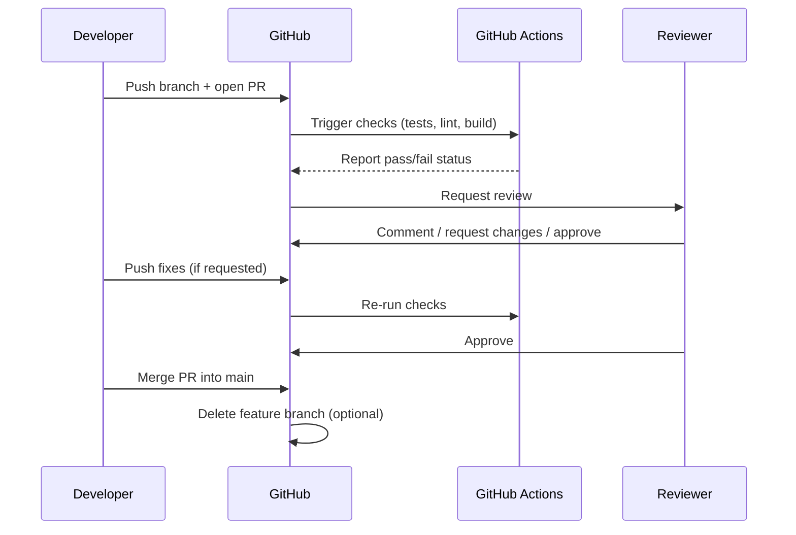
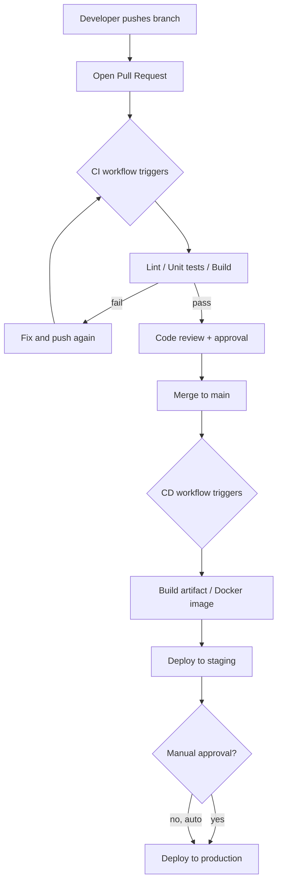

# GitHub — Full 360°: Git Concepts, Pull Requests, Actions, CI/CD, and the GH-600 Exam

## Part 1 — Git vs GitHub (don't confuse them)

- **Git** = the version control *tool* (works fully offline, on your own
  machine, invented by Linus Torvalds).
- **GitHub** = a *hosting platform* for Git repositories, plus a layer of
  collaboration tools on top: Pull Requests, Issues, Actions, Projects,
  code review, security scanning.

You can use Git without GitHub (e.g. host your own server, or GitLab/
Bitbucket instead). GitHub adds the social/collaboration/automation layer.

---

## Part 2 — Core Git concepts (the vocabulary)

| Term | What it means |
|---|---|
| **Repository (repo)** | The project folder tracked by Git, including its full history. |
| **Commit** | A saved snapshot of changes, with a message, author, and unique hash (e.g. `a1b2c3d`). |
| **Branch** | A pointer to a line of commits — lets you work on something without touching `main`. |
| **`main`/`master`** | The default, usually "production-ready," branch. |
| **Merge** | Combining the changes from one branch into another. |
| **Pull Request (PR)** | A GitHub feature: "I want to merge branch X into branch Y — please review it first." |
| **Fork** | A full copy of someone else's repo into your own account, to propose changes without write access to the original. |
| **Clone** | Downloading a copy of a remote repo to your machine. |
| **Remote** | A reference to a repo hosted elsewhere (e.g. `origin` = your GitHub repo). |
| **Push/Pull** | Sending your local commits to the remote (`push`) / fetching and merging remote commits into your local branch (`pull`). |
| **Tag** | A fixed label on a specific commit, usually used for releases (`v1.2.0`). |
| **`.gitignore`** | A file listing what Git should never track (e.g. `node_modules/`, `.env`). |

### The everyday commit flow
```bash
git status                     # what's changed?
git add file.py                # stage a file for the next commit
git commit -m "fix: handle null input"
git push origin my-branch      # send commits to GitHub
```

### Branching flow
```bash
git checkout -b feature/login  # create + switch to a new branch
# ...make changes, commit...
git push -u origin feature/login
# then open a Pull Request on GitHub
```

---

## Part 3 — Pull Requests (PRs), reviews, and merging

### What a PR actually is
A PR is a **request + a diff + a conversation**, all in one page:
"here's what changed on `feature/login`, please review before it merges
into `main`."

### Typical PR lifecycle


### The 3 merge strategies (this trips a lot of people up)

| Strategy | What happens to history | When to use |
|---|---|---|
| **Merge commit** | Keeps all individual commits + adds one new "merge commit" tying them together | You want full, detailed history of every commit on the branch |
| **Squash and merge** | Combines *all* commits on the branch into **one single commit** on `main` | Cleanest history — most teams' default for feature branches |
| **Rebase and merge** | Replays each commit from the branch onto `main` individually, no merge commit | Linear history, but rewrites commit hashes — riskier on shared branches |

### Branch protection rules
Settings you put on `main` (or any branch) to prevent bad merges:
- Require PR review(s) before merging (e.g. "at least 1 approval").
- Require status checks to pass (CI must be green).
- Require branches to be up to date before merging.
- Block force-pushes and deletions.
- Require signed commits.

### Draft PRs vs. ready PRs
A **Draft PR** signals "work in progress, not ready for review yet" — CI
still runs, but reviewers know not to approve it yet.

### Merge conflicts
Happen when the same lines were changed differently on two branches. Git
can't auto-decide, so it marks the conflict for you to resolve manually:
```
<<<<<<< HEAD
your version
=======
their version
>>>>>>> feature/login
```
You edit the file to keep the correct result, then `git add` + commit to
finish the merge.

---

## Part 4 — GitHub Actions (automation & CI/CD)

### What it is
**GitHub Actions** is GitHub's built-in automation engine: run scripts
("workflows") automatically in response to events in your repo (push, PR
opened, a schedule, a manual click, an external webhook...).

### Core building blocks

| Term | Meaning |
|---|---|
| **Workflow** | A YAML file (`.github/workflows/*.yml`) describing when and what to run. |
| **Event / trigger** | What starts the workflow (`push`, `pull_request`, `schedule`, `workflow_dispatch`, `release`...). |
| **Job** | A group of steps that run on the same machine (runner). A workflow can have multiple jobs, which run in parallel by default. |
| **Step** | One command or action inside a job — runs sequentially. |
| **Action** | A reusable packaged step (yours, or from the [Marketplace](https://github.com/marketplace/actions), e.g. `actions/checkout`). |
| **Runner** | The machine executing the job — GitHub-hosted (Ubuntu/Windows/macOS VMs) or **self-hosted** (your own server/container). |
| **Secret** | An encrypted value (API keys, tokens) stored in repo/org settings, injected as an environment variable during the run — never printed in logs. |
| **Artifact** | A file produced by a job (e.g. a build output) that can be passed to another job or downloaded later. |
| **Matrix** | Run the same job multiple times with different variables (e.g. test on Python 3.10, 3.11, 3.12 in parallel). |

### Minimal example workflow
```yaml
# .github/workflows/ci.yml
name: CI

on:
  push:
    branches: [main]
  pull_request:
    branches: [main]

jobs:
  test:
    runs-on: ubuntu-latest
    strategy:
      matrix:
        python-version: ["3.10", "3.11", "3.12"]
    steps:
      - uses: actions/checkout@v4
      - uses: actions/setup-python@v5
        with:
          python-version: ${{ matrix.python-version }}
      - run: pip install -r requirements.txt
      - run: pytest
```

### Full CI/CD example: test → build → deploy
```yaml
name: CI/CD

on:
  push:
    branches: [main]

jobs:
  test:
    runs-on: ubuntu-latest
    steps:
      - uses: actions/checkout@v4
      - run: npm ci
      - run: npm test

  build:
    needs: test               # only runs if 'test' succeeds
    runs-on: ubuntu-latest
    steps:
      - uses: actions/checkout@v4
      - run: npm run build
      - uses: actions/upload-artifact@v4
        with:
          name: dist
          path: dist/

  deploy:
    needs: build
    runs-on: ubuntu-latest
    environment: production   # can require manual approval here
    steps:
      - uses: actions/download-artifact@v4
        with:
          name: dist
      - run: echo "deploying..."
        env:
          DEPLOY_TOKEN: ${{ secrets.DEPLOY_TOKEN }}
```

### CI vs. CD, precisely
- **CI (Continuous Integration)** = automatically build + test every
  change, so problems are caught immediately, before merging.
- **CD (Continuous Delivery)** = automatically prepare a release-ready
  build after CI passes (may require a manual "deploy" click).
- **CD (Continuous Deployment)** = automatically ship straight to
  production after CI passes, with no manual step.

### Environments and approvals
GitHub **Environments** (e.g. `staging`, `production`) can require manual
approval, restrict which branches can deploy, and hold environment-specific
secrets — the standard way to gate production deploys in Actions.

### Reusable workflows & composite actions
- **Reusable workflow**: a whole workflow file called from another
  (`uses: org/repo/.github/workflows/deploy.yml@main`) — avoids duplicating
  CI/CD logic across many repos.
- **Composite action**: a bundle of steps packaged as one reusable action.

### GitHub-hosted vs. self-hosted runners

| | GitHub-hosted | Self-hosted |
|---|---|---|
| Setup | Zero setup, GitHub manages it | You provision/maintain the machine |
| Cost | Free minutes/month (varies by plan), then billed per minute | Your own infra cost, but Actions usage itself is free |
| Use case | Most workflows | Special hardware, private network access, GPU jobs, cost control at scale |

### Security notes for Actions
- Never hardcode secrets in the YAML — always use `secrets.*`.
- Pin third-party actions to a commit SHA (not just `@v4`) for
  supply-chain safety in sensitive pipelines.
- `pull_request_target` vs `pull_request` — `pull_request_target` runs
  with access to secrets even on forked PRs, so it's a common security
  footgun if misused (never checkout + run untrusted fork code with it).

---

## Part 5 — Other CI/CD-adjacent GitHub features

| Feature | Purpose |
|---|---|
| **GitHub Packages** | Host build artifacts/containers/npm/Docker images alongside your code. |
| **Dependabot** | Automatically opens PRs to bump outdated/vulnerable dependencies. |
| **CodeQL / Code Scanning** | Static analysis to catch security vulnerabilities automatically, often run as an Action on every PR. |
| **Secret scanning** | Detects accidentally committed API keys/secrets and can block the push (push protection). |
| **Deployments API / Environments** | Track and gate what's deployed where. |
| **Releases** | Tag + package a version of your software, often triggered by Actions on a `v*` tag push. |
| **GitHub Projects** | Kanban/roadmap boards linked to Issues/PRs, for planning work (not CI/CD itself, but part of the full workflow). |

---

## Part 6 — A full CI/CD mental model, end to end



---

## Part 7 — Preparing for the GH-600 exam

**Verified against the official Microsoft Learn study guide** (Exam GH-600,
last updated 2026-07-09): [learn.microsoft.com/.../study-guides/gh-600](https://learn.microsoft.com/en-us/credentials/certifications/resources/study-guides/gh-600).

### What GH-600 actually is
**GH-600: Developing in Agentic AI Systems** — this is **not** the same
exam as GH-300 (GitHub Copilot). GH-600 is a newer, more advanced
certification focused specifically on **building, operating, and
governing autonomous AI coding agents** (GitHub Copilot agents, MCP
servers, multi-agent workflows) inside real SDLC pipelines — not on
day-to-day Copilot autocomplete usage.

**Passing score:** 700+ (as with other Microsoft-administered certs).

### Who it's for
Someone with subject-matter expertise **operating, integrating,
supervising, and governing AI agents** inside production-grade SDLC
workflows, using GitHub as the system of record and control plane.
Expected background: SDLC fundamentals, GitHub workflows/controls, code
quality/security/review practices, and hands-on experience with coding
agents (Copilot), MCP servers, and agent customization (custom
instructions, custom agents, tools, Copilot setup steps).

### The 6 skill domains (with official weightings)

| # | Domain | Weight |
|---|---|---|
| 1 | Prepare agent architecture and SDLC processes | 15–20% |
| 2 | Implement tool use and environment interaction | 20–25% |
| 3 | Manage memory, state, and execution | 10–15% |
| 4 | Perform evaluation, error analysis, and tuning | 15–20% |
| 5 | Orchestrate multi-agent coordination | 15–20% |
| 6 | Implement guardrails and accountability | 10–15% |

#### 1. Prepare agent architecture and SDLC processes (15–20%)
- Integrate agents into the SDLC: which steps agents should perform, common
  agent anti-patterns, defining inputs/outputs/success criteria.
- Separate **planning** from **action**: force agents to output a
  structured plan, validate it, and block execution until it's approved.
- Configure observability: autonomy levels/guardrails, inspectable
  artifacts in standard dev tooling, human intervention without slowing
  delivery.

#### 2. Implement tool use and environment interaction (20–25%) — the biggest domain
- Select/configure agent tools and tool **permissions**.
- **MCP servers**: add one as a tool, configure a GitHub remote MCP
  server, configure MCP registries and allow lists.
- Integrate agents into dev environments: scope an agent to a repo or
  branch, invoke it in a CI workflow, let it autonomously create branches/
  PRs, handle environment-specific constraints.
- Safe execution: error handling, retries, rollbacks, escalation paths,
  traceability/accountability for agent actions.

#### 3. Manage memory, state, and execution (10–15%)
- Choose short-term vs. long-term vs. external memory; scope memory to
  task-relevant info; define expiration/pruning/reset rules.
- Persist agent state as durable artifacts so work can resume without
  repeating steps; detect and correct **context drift** in long-running
  agent tasks.
- Share state across tools/environments while preventing conflicting or
  stale context.

#### 4. Perform evaluation, error analysis, and tuning (15–20%)
- Define success criteria/evaluation signals (qualitative + quantitative,
  including automated scanning tools) aligned to development intent.
- Diagnose failures using logs, plans, traces, outputs, workflow
  artifacts; classify root causes (reasoning errors, tool misuse, context/
  environment issues).
- Tune behavior: revise instructions/workflows/constraints, refine memory
  and tool usage.

#### 5. Orchestrate multi-agent coordination (15–20%)
- Apply orchestration patterns across multiple agents; isolate agents for
  parallel execution; resolve conflicts (overlapping code changes,
  duplicated effort, contradictory outputs).
- Produce audit-ready artifacts for multi-agent workflows; document
  handoffs/decisions; do post-hoc analysis.
- Detect stalled/degraded agents and apply recovery patterns (rollback,
  human-in-the-loop).
- Manage agent lifecycle inside multi-agent workflows: add, reconfigure,
  replace, or retire agents without breaking active workflows, while
  preserving auditability.

#### 6. Implement guardrails and accountability (10–15%)
- Classify agent actions by operational/security/compliance risk; assign
  **autonomy levels** balancing delivery speed against compliance.
- Guardrails: block policy-violating actions, enforce least-privilege
  scoping, require explicit authorization for irreversible/compliance-
  sensitive changes, and avoid approval steps that don't meaningfully
  reduce risk.

### Official prep resources
- **Microsoft Learn paths:** *Foundations of Agentic AI in GitHub*,
  *Designing Agent Architecture and SDLC Integration*, *Tooling, MCP, and
  Agent Execution Environments*.
- **GitHub Docs (mapped to each domain):** GitHub's Copilot custom-agents
  docs, Copilot SDK custom-agents guide, Copilot memory concepts,
  implementation-planner tutorial, cloud-agent guardrails/risk docs.
- **Community:** GitHub Community Discussions, the GitHub Blog.

### How to prepare, practically
1. **Actually build a custom agent.** Set up GitHub Copilot custom
   instructions/custom agents in a real repo, wire up an MCP server, and
   scope its tool permissions and allow list yourself — the "Implement
   tool use" domain is the single biggest chunk of the exam (20–25%).
2. **Practice the plan → approve → act loop.** Configure an agent so it
   must output a structured plan and get it approved before touching
   code — this exact separation ("planning vs. action") is explicitly
   tested.
3. **Run a multi-agent scenario.** Even a simple one — two agents touching
   overlapping files — so you've seen firsthand what a coordination
   conflict looks like and how rollback/human-in-the-loop recovery works.
4. **Get comfortable reading agent artifacts**, not just writing code:
   logs, traces, plans, and evaluation signals are how you diagnose
   failures on this exam, not just "did the code compile."
5. **Study the guardrails/autonomy-level framework** — expect scenario
   questions asking you to classify an action's risk and decide whether it
   needs human approval or can run autonomously.
6. **Don't confuse this with GH-300** (GitHub Copilot certification, which
   tests everyday Copilot usage — completions, Chat, `/explain`/`/fix`).
   GH-600 assumes you already know that and tests agentic/orchestration
   concepts on top.

---

## TL;DR

- **Git** = the tool, **GitHub** = the platform + collaboration/automation
  layer on top.
- **Pull Requests** = review-and-merge workflow; **merge strategy**
  (merge/squash/rebase) shapes your history — squash is the common default.
- **GitHub Actions** = YAML-defined workflows triggered by repo events,
  running jobs made of steps on runners — the backbone of GitHub-native
  CI/CD.
- **CI** catches problems early (test/build on every PR); **CD** automates
  getting a passing build into staging/production, optionally gated by
  manual approval via Environments.
- **GH-600 = "Developing in Agentic AI Systems"** (distinct from GH-300
  Copilot): tests building/operating/governing autonomous coding agents —
  tool use & MCP servers (20–25%, the biggest domain), SDLC integration,
  memory/state management, evaluation/tuning, multi-agent orchestration,
  and guardrails/accountability. Passing score 700+. Prep by actually
  building a custom agent with an MCP server and tool permissions, not
  just reading docs.
