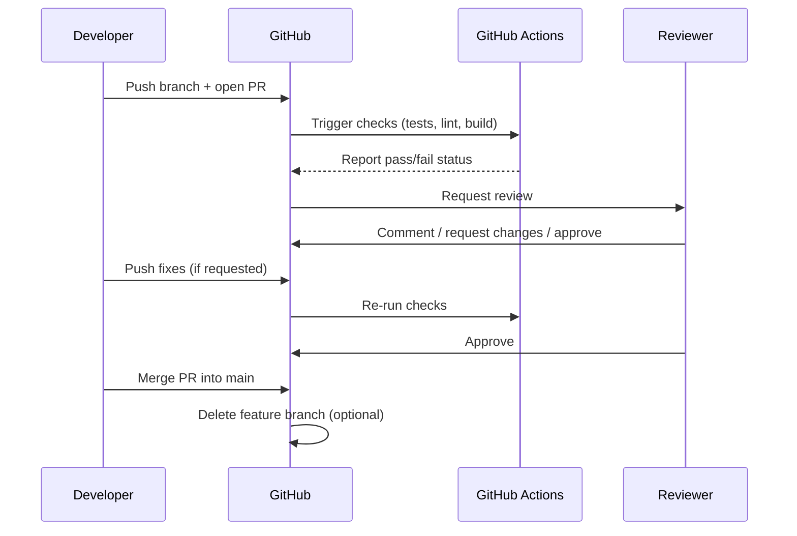
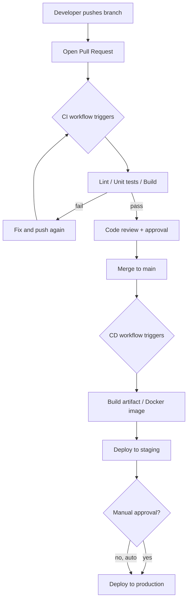

# GitHub — Full 360°: Git Concepts, Pull Requests, Actions, CI/CD, and the GH-600 Exam

## Part 1 — Git vs GitHub (don't confuse them)

- **Git** = the version control *tool* (works fully offline, on your own
  machine, invented by Linus Torvalds).
- **GitHub** = a *hosting platform* for Git repositories, plus a layer of
  collaboration tools on top: Pull Requests, Issues, Actions, Projects,
  code review, security scanning.

You can use Git without GitHub (e.g. host your own server, or GitLab/
Bitbucket instead). GitHub adds the social/collaboration/automation layer.

---

## Part 2 — Core Git concepts (the vocabulary)

| Term | What it means |
|---|---|
| **Repository (repo)** | The project folder tracked by Git, including its full history. |
| **Commit** | A saved snapshot of changes, with a message, author, and unique hash (e.g. `a1b2c3d`). |
| **Branch** | A pointer to a line of commits — lets you work on something without touching `main`. |
| **`main`/`master`** | The default, usually "production-ready," branch. |
| **Merge** | Combining the changes from one branch into another. |
| **Pull Request (PR)** | A GitHub feature: "I want to merge branch X into branch Y — please review it first." |
| **Fork** | A full copy of someone else's repo into your own account, to propose changes without write access to the original. |
| **Clone** | Downloading a copy of a remote repo to your machine. |
| **Remote** | A reference to a repo hosted elsewhere (e.g. `origin` = your GitHub repo). |
| **Push/Pull** | Sending your local commits to the remote (`push`) / fetching and merging remote commits into your local branch (`pull`). |
| **Tag** | A fixed label on a specific commit, usually used for releases (`v1.2.0`). |
| **`.gitignore`** | A file listing what Git should never track (e.g. `node_modules/`, `.env`). |

### The everyday commit flow
```bash
git status                     # what's changed?
git add file.py                # stage a file for the next commit
git commit -m "fix: handle null input"
git push origin my-branch      # send commits to GitHub
```

### Branching flow
```bash
git checkout -b feature/login  # create + switch to a new branch
# ...make changes, commit...
git push -u origin feature/login
# then open a Pull Request on GitHub
```

---

## Part 3 — Pull Requests (PRs), reviews, and merging

### What a PR actually is
A PR is a **request + a diff + a conversation**, all in one page:
"here's what changed on `feature/login`, please review before it merges
into `main`."

### Typical PR lifecycle


### The 3 merge strategies (this trips a lot of people up)

| Strategy | What happens to history | When to use |
|---|---|---|
| **Merge commit** | Keeps all individual commits + adds one new "merge commit" tying them together | You want full, detailed history of every commit on the branch |
| **Squash and merge** | Combines *all* commits on the branch into **one single commit** on `main` | Cleanest history — most teams' default for feature branches |
| **Rebase and merge** | Replays each commit from the branch onto `main` individually, no merge commit | Linear history, but rewrites commit hashes — riskier on shared branches |

### Branch protection rules
Settings you put on `main` (or any branch) to prevent bad merges:
- Require PR review(s) before merging (e.g. "at least 1 approval").
- Require status checks to pass (CI must be green).
- Require branches to be up to date before merging.
- Block force-pushes and deletions.
- Require signed commits.

### Draft PRs vs. ready PRs
A **Draft PR** signals "work in progress, not ready for review yet" — CI
still runs, but reviewers know not to approve it yet.

### Merge conflicts
Happen when the same lines were changed differently on two branches. Git
can't auto-decide, so it marks the conflict for you to resolve manually:
```
<<<<<<< HEAD
your version
=======
their version
>>>>>>> feature/login
```
You edit the file to keep the correct result, then `git add` + commit to
finish the merge.

---

## Part 4 — GitHub Actions (automation & CI/CD)

### What it is
**GitHub Actions** is GitHub's built-in automation engine: run scripts
("workflows") automatically in response to events in your repo (push, PR
opened, a schedule, a manual click, an external webhook...).

### Core building blocks

| Term | Meaning |
|---|---|
| **Workflow** | A YAML file (`.github/workflows/*.yml`) describing when and what to run. |
| **Event / trigger** | What starts the workflow (`push`, `pull_request`, `schedule`, `workflow_dispatch`, `release`...). |
| **Job** | A group of steps that run on the same machine (runner). A workflow can have multiple jobs, which run in parallel by default. |
| **Step** | One command or action inside a job — runs sequentially. |
| **Action** | A reusable packaged step (yours, or from the [Marketplace](https://github.com/marketplace/actions), e.g. `actions/checkout`). |
| **Runner** | The machine executing the job — GitHub-hosted (Ubuntu/Windows/macOS VMs) or **self-hosted** (your own server/container). |
| **Secret** | An encrypted value (API keys, tokens) stored in repo/org settings, injected as an environment variable during the run — never printed in logs. |
| **Artifact** | A file produced by a job (e.g. a build output) that can be passed to another job or downloaded later. |
| **Matrix** | Run the same job multiple times with different variables (e.g. test on Python 3.10, 3.11, 3.12 in parallel). |

### Minimal example workflow
```yaml
# .github/workflows/ci.yml
name: CI

on:
  push:
    branches: [main]
  pull_request:
    branches: [main]

jobs:
  test:
    runs-on: ubuntu-latest
    strategy:
      matrix:
        python-version: ["3.10", "3.11", "3.12"]
    steps:
      - uses: actions/checkout@v4
      - uses: actions/setup-python@v5
        with:
          python-version: ${{ matrix.python-version }}
      - run: pip install -r requirements.txt
      - run: pytest
```

### Full CI/CD example: test → build → deploy
```yaml
name: CI/CD

on:
  push:
    branches: [main]

jobs:
  test:
    runs-on: ubuntu-latest
    steps:
      - uses: actions/checkout@v4
      - run: npm ci
      - run: npm test

  build:
    needs: test               # only runs if 'test' succeeds
    runs-on: ubuntu-latest
    steps:
      - uses: actions/checkout@v4
      - run: npm run build
      - uses: actions/upload-artifact@v4
        with:
          name: dist
          path: dist/

  deploy:
    needs: build
    runs-on: ubuntu-latest
    environment: production   # can require manual approval here
    steps:
      - uses: actions/download-artifact@v4
        with:
          name: dist
      - run: echo "deploying..."
        env:
          DEPLOY_TOKEN: ${{ secrets.DEPLOY_TOKEN }}
```

### CI vs. CD, precisely
- **CI (Continuous Integration)** = automatically build + test every
  change, so problems are caught immediately, before merging.
- **CD (Continuous Delivery)** = automatically prepare a release-ready
  build after CI passes (may require a manual "deploy" click).
- **CD (Continuous Deployment)** = automatically ship straight to
  production after CI passes, with no manual step.

### Environments and approvals
GitHub **Environments** (e.g. `staging`, `production`) can require manual
approval, restrict which branches can deploy, and hold environment-specific
secrets — the standard way to gate production deploys in Actions.

### Reusable workflows & composite actions
- **Reusable workflow**: a whole workflow file called from another
  (`uses: org/repo/.github/workflows/deploy.yml@main`) — avoids duplicating
  CI/CD logic across many repos.
- **Composite action**: a bundle of steps packaged as one reusable action.

### GitHub-hosted vs. self-hosted runners

| | GitHub-hosted | Self-hosted |
|---|---|---|
| Setup | Zero setup, GitHub manages it | You provision/maintain the machine |
| Cost | Free minutes/month (varies by plan), then billed per minute | Your own infra cost, but Actions usage itself is free |
| Use case | Most workflows | Special hardware, private network access, GPU jobs, cost control at scale |

### Security notes for Actions
- Never hardcode secrets in the YAML — always use `secrets.*`.
- Pin third-party actions to a commit SHA (not just `@v4`) for
  supply-chain safety in sensitive pipelines.
- `pull_request_target` vs `pull_request` — `pull_request_target` runs
  with access to secrets even on forked PRs, so it's a common security
  footgun if misused (never checkout + run untrusted fork code with it).

---

## Part 5 — Other CI/CD-adjacent GitHub features

| Feature | Purpose |
|---|---|
| **GitHub Packages** | Host build artifacts/containers/npm/Docker images alongside your code. |
| **Dependabot** | Automatically opens PRs to bump outdated/vulnerable dependencies. |
| **CodeQL / Code Scanning** | Static analysis to catch security vulnerabilities automatically, often run as an Action on every PR. |
| **Secret scanning** | Detects accidentally committed API keys/secrets and can block the push (push protection). |
| **Deployments API / Environments** | Track and gate what's deployed where. |
| **Releases** | Tag + package a version of your software, often triggered by Actions on a `v*` tag push. |
| **GitHub Projects** | Kanban/roadmap boards linked to Issues/PRs, for planning work (not CI/CD itself, but part of the full workflow). |

---

## Part 6 — A full CI/CD mental model, end to end



---

## Part 7 — Preparing for the GH-600 exam

> **Important caveat:** GitHub's certification numbering has shifted over
> time and this space evolves, so **always cross-check the current exam
> number and objectives on GitHub's official certifications page**
> (`github.com/certification`) before relying on any specific number.
> As of the most recent naming, GitHub's certification family generally
> looks like:
> - **GH-900** — GitHub Foundations (broad intro: repos, PRs, Issues, basic Actions)
> - **GH-200** — GitHub Actions (deep dive: workflows, runners, security)
> - **GH-300** — GitHub Copilot (AI pair programming) *(numbering for the Copilot exam has changed across versions — verify current code)*
> - **GH-500** — GitHub Advanced Security (CodeQL, secret scanning, dependency review)
> - **GH-600** — most recently associated with the **GitHub Copilot certification**, testing practical use of Copilot (Chat, code completion, agent mode, prompt engineering for code, responsible AI use) rather than plain repo/Actions mechanics.
>
> Since the number-to-topic mapping is the part most likely to have moved
> since this was written, **verify the current GH-600 exam guide on
> GitHub's site before studying** — the domains below are the general
> shape of what these exams test either way, so they're useful prep
> regardless of the exact current code.

### General domains these certification exams tend to test
1. **Git & GitHub fundamentals**
   - Repos, branches, commits, merge strategies, conflict resolution.
   - Forks vs. clones, upstream/origin remotes.
2. **Collaboration workflow**
   - Pull requests, code review process, branch protection rules.
   - Issues, Discussions, Projects (linking work items to code).
3. **GitHub Actions / CI-CD**
   - Workflow syntax (events, jobs, steps, matrix, `needs`).
   - Secrets management, environments, approvals.
   - Reusable workflows, composite actions, self-hosted runners.
4. **Security**
   - Dependabot alerts/updates, secret scanning, push protection.
   - CodeQL / code scanning basics, security policies (`SECURITY.md`).
5. **GitHub administration** (more relevant to GH-300 Administration, but
   often lightly touched elsewhere)
   - Organizations, teams, permissions (read/write/admin, roles).
   - SSO, audit logs, repository visibility settings.
6. **If it's Copilot-focused (GH-600 as most recently defined)**
   - How Copilot suggestions are generated and how context (open files,
     comments) shapes them.
   - Copilot Chat usage patterns: `/explain`, `/fix`, `/tests`, inline chat.
   - Copilot in the CLI, in PRs (Copilot code review), and "agent mode."
   - Responsible AI: what Copilot does and doesn't guarantee (license/
     attribution considerations, reviewing AI-suggested code before merge).
   - Prompt-crafting best practices for getting better code suggestions.

### How to prepare, practically
1. **Do it, don't just read it.** Create a scratch repo, open real PRs
   against yourself, break a merge on purpose and resolve the conflict,
   write an Actions workflow from scratch (not copy-paste) until you don't
   need the docs open.
2. **Read the official GitHub Docs sections** for whichever exam you're
   targeting — GitHub publishes an official *study guide/exam objectives
   PDF* per certification; get that exact document, since it lists the
   graded domains verbatim.
3. **Use GitHub Skills** (`skills.github.com`) — free, official,
   hands-on interactive courses (Actions, Copilot, security) that mirror
   real exam scenarios.
4. **Practice writing YAML from memory** — a large share of Actions-related
   questions hinge on knowing workflow syntax (trigger keys, `needs`,
   `matrix`, `if:` conditions) without an editor's autocomplete to help.
5. **Know the "why," not just the "how"** — expect scenario questions like
   "which merge strategy best suits this team's need for X" rather than
   pure syntax recall.
6. **If it is indeed Copilot-focused:** actually use Copilot daily for a
   couple of weeks beforehand — Chat, inline suggestions, PR summaries —
   the exam leans on familiarity with the *experience*, not just theory.

---

## TL;DR

- **Git** = the tool, **GitHub** = the platform + collaboration/automation
  layer on top.
- **Pull Requests** = review-and-merge workflow; **merge strategy**
  (merge/squash/rebase) shapes your history — squash is the common default.
- **GitHub Actions** = YAML-defined workflows triggered by repo events,
  running jobs made of steps on runners — the backbone of GitHub-native
  CI/CD.
- **CI** catches problems early (test/build on every PR); **CD** automates
  getting a passing build into staging/production, optionally gated by
  manual approval via Environments.
- **GH-600 prep**: confirm the current official exam guide first (numbers
  shift), then combine hands-on repo/Actions practice with GitHub's free
  Skills courses — expect scenario-based questions, not just syntax recall.
